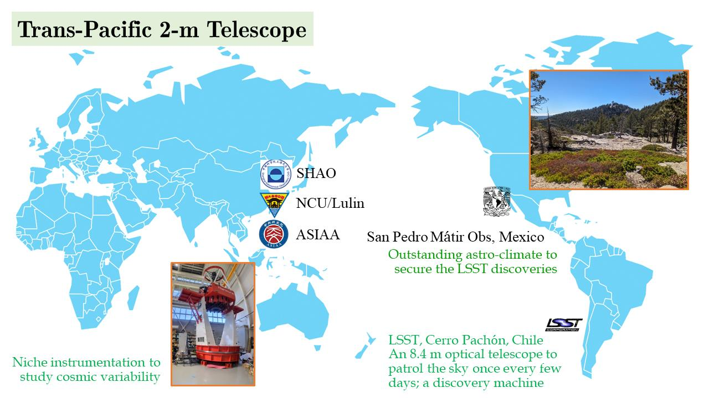
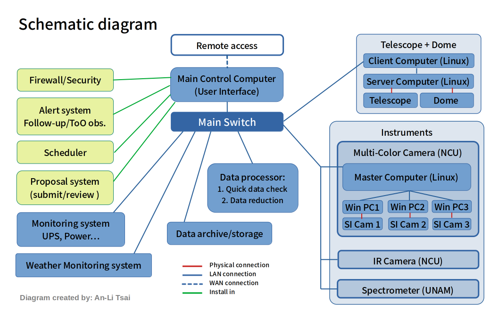

# Project Overview & Status Updates
## The Trans-Pacific Two-Meter (TP2m) Telescope

The upcoming (2027) **Trans-Pacific Two-Meter Telescope (TP2m)** is poised to become a critical tool for **time-domain astronomy**, focusing on the observation of **transients** and **Targets of Opportunity (ToOs)**. Located at San Pedro Mártir Observatory in Mexico, it operates about three hours behind the Vera C. Rubin Observatory's LSST and eight hours ahead of **Taiwan’s Lulin One-Meter Telescope (LOT)**, forming a collaborative, **multi-time-zone network** to monitor transient events. When **LSST** detects and identifies potential targets, TP2m and LOT provide timely follow-up observations. By confirming and characterizing transient phenomena such as **supernovae, gamma-ray bursts, and kilonovae**, TP2m will make significant contributions to the global study of dynamic celestial phenomena. 

(Image credit: NCUIA)

TP2m team has six partners:
- **NCUIA (Institute of Astronomy, National Central University, Taiwan) 中央大學天文所**
- ASIAA (Institute of Astronomy & Astrophysics, Academia Sinica, Taiwan) 中研院天文與天文物理研究所
- SHAO (SHanghai Astronomical Observatory, China) 上海天文台
- HNAS (HeNan Academy of Sciences, China) 河南省科學院
- **UNAM (Universidad Nacional Autónoma de México, Mexico) 墨西哥自治大學**
- AMU (Aix-Marseille Université, France) 法國艾克斯-馬賽大學

## TP2m Telescope Control System (TCS) software
*Note: The following TCS architecture is based on the current understanding and planning by the Taiwan team. The final design will be updated.

The current concept of the TP2m Control System (TCS) software is shown in the following schematic diagram.

(Image credit: An-Li Tsai)

The TCS includes several modules.
- **Telescope & Dome control (NCUIA's telescope)**
- **CCD camera control (NCUIA's instrument)**
- IR camera control (NCUIA's instrument)
- Spectrometer control (UNAM's instrument)
- Weather monitoring system
- Scheduler
- Alert system (ex. transient/ToO events…)
- Data processor
- Data storage/transfer/mirror site
- Monitoring on UPS, power... 
- Logs
- Firewall
- Proposal submission/review
- **UI for observers**
- **UI for engineers**
- UI for proposal applicants/reviewers 

---

### Article Update Log
- README.md created by An-Li Tsai (2025/07/03).
- Update images (2025/07/04).
- Update content (2025/07/22)
