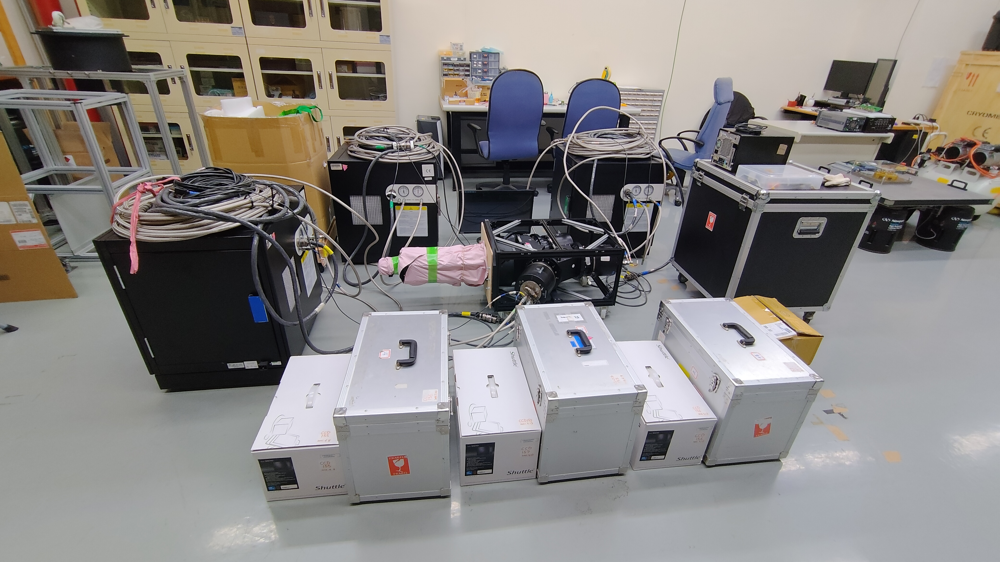
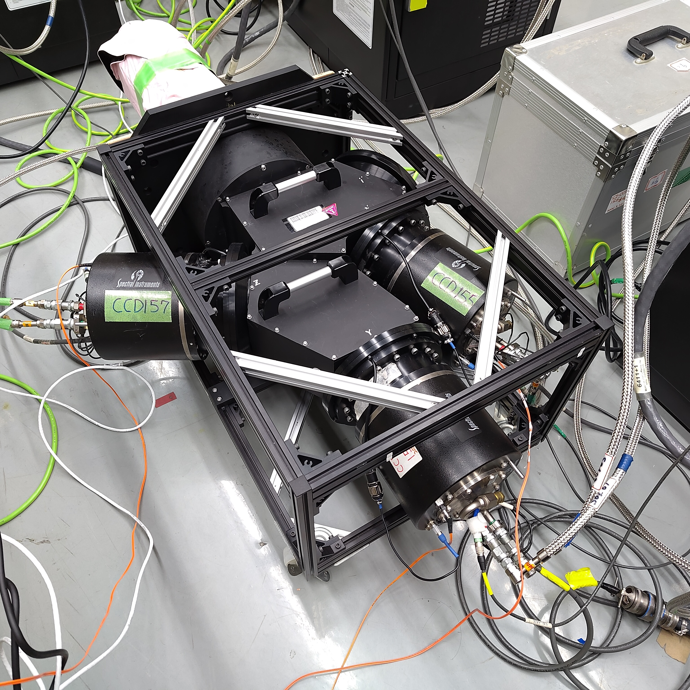
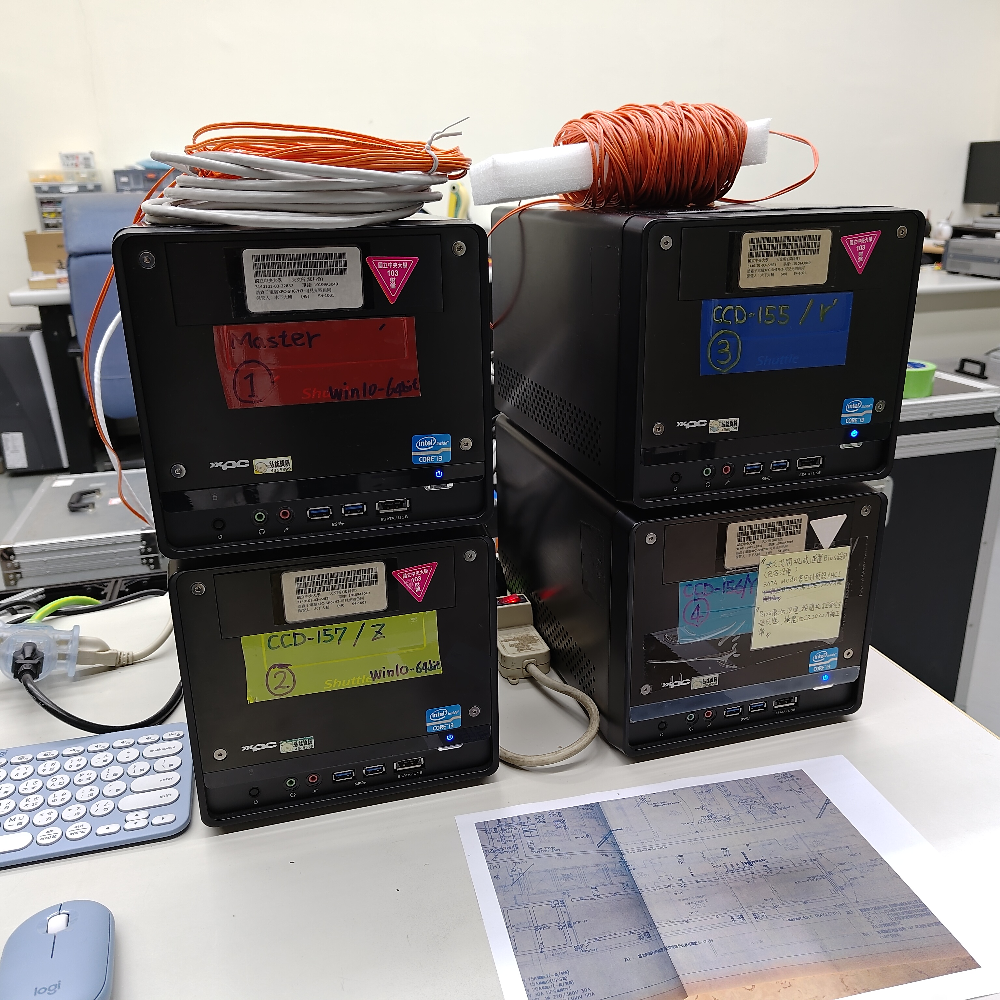
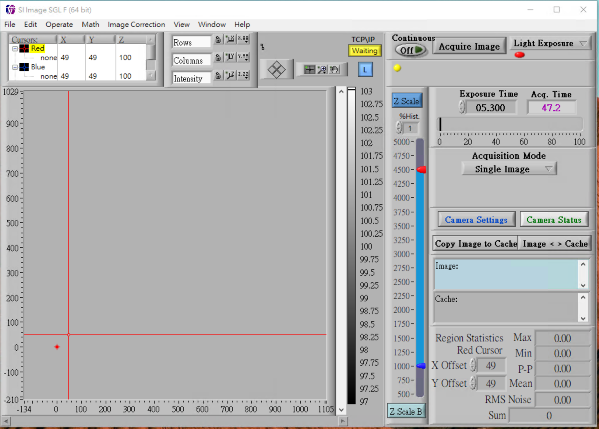
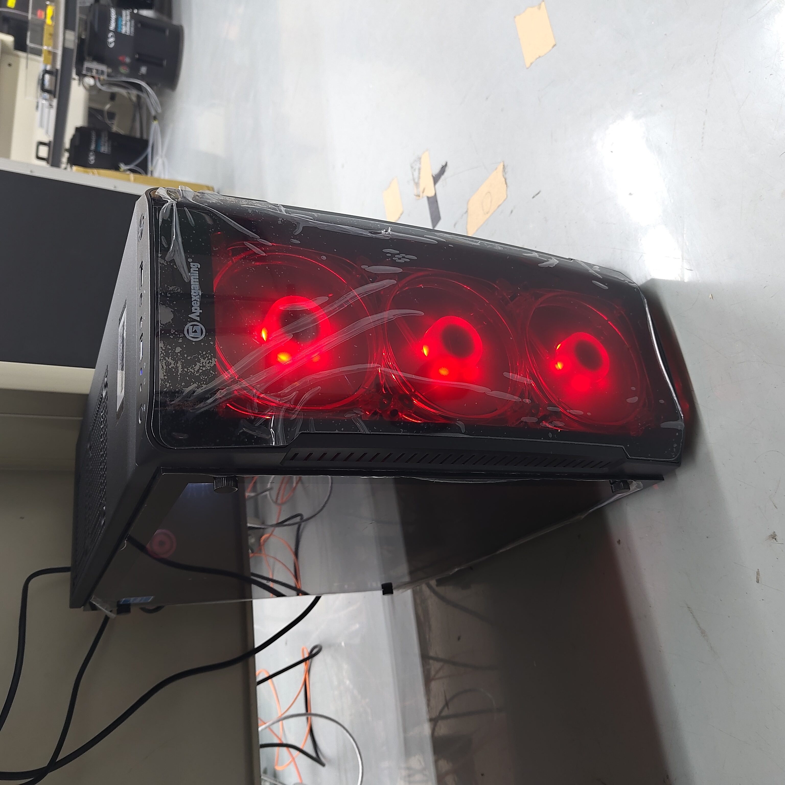
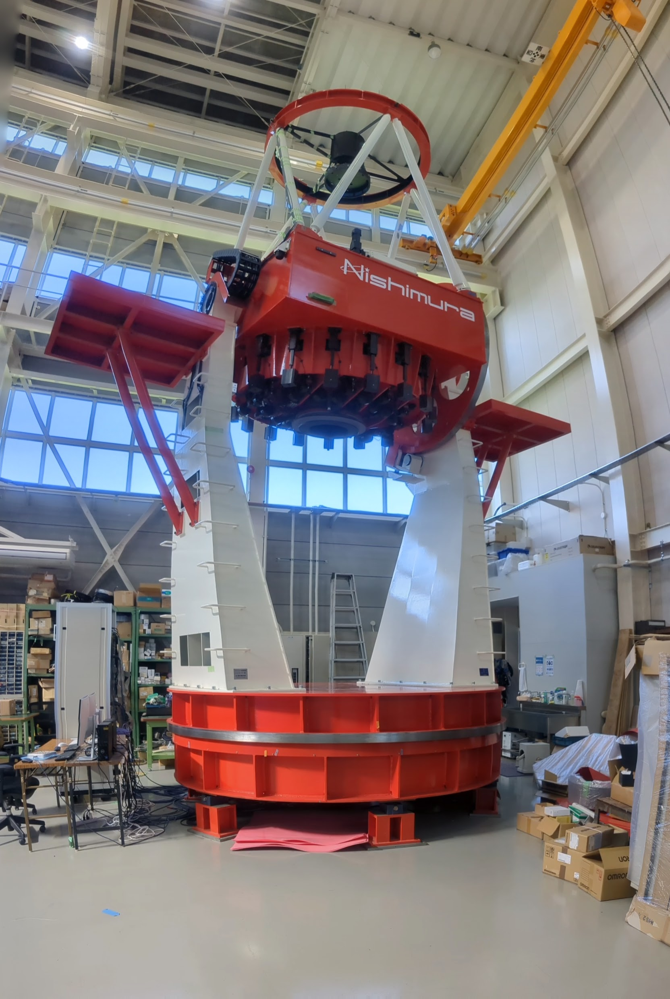
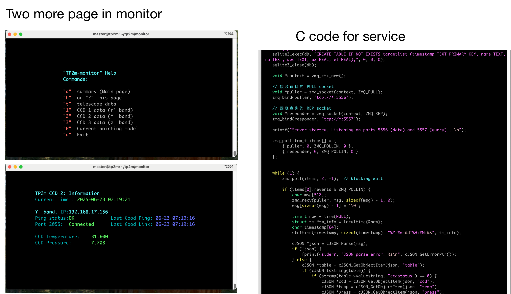

## TCS Software - Taiwan team
Taiwan team (NCUIA and ASIAA) is working on hardware communication, specifically for：
1. Multi-color CCD Camera 
2. Telescope communication 
3. UI for Observers and Engineers

### 1. The Multi-color CCD Camera control
#### Hardware Info
- Current location: ASIAA B1, Taipai, Taiwan  
  
  (Image credit: An-Li Tsai)
- Manufacture: Spectral Instrument (SI) Inc.
- Number of CCD Cameras: 3  
  
  (Image credit: An-Li Tsai)
- CCD Type: SI-1100
- CCD size: 2048 x 4096
- Filter: ccd155: r’ ; ccd156: y ; ccd157: z
- CCD Type: E2V 44-82 NIMO BI DD Astronomy process ER1 coating
- Cooler Type: PT-30 cryotiger  

#### Software Info
- Server Software
    - OS: Windows PC (each CCD is controlled by one PC)
    
    (Image credit: An-Li Tsai)
    - Software: *"SI Image SGL Rev.F"*
    
    (Image credit: An-Li Tsai)
    - Manual: *"SI Image SGL Rev.F"*

- Client Software
    - OS: Linux
    
    (Image credit: An-Li Tsai)
    - Status: In development.
    - Developers: Sheng-Feng Yen, Wei-Hung Liao, and An-Li Tsai

### 2. The Telescope & Dome control
#### Hardware Info
- Current location: Nishimura Mfg., Shiga, Japan
- Manufacture: Nishimura Telescope Mfg.
    
    (Image credit: Nishimura Mfg.)
- Prime Mirror Clear Aperture: 2,000mm
- Prime Mirror Focus Length: 4,000mm
- Optical System  FOV at prime Focus: 1.0゜
- Second Mirror Clear Aperture: 609mm
- Mechanism System Type: Alt-Azimuth mount Friction Drive
- Pointing Accuracy: 2 arcsec RMS/Altitude: over 30-88 degrees
- Drive Speed: maximum slew rate 4 degrees/sec Azimuth and 2 degrees/sec Altitude axes
- Zenith Blind Spot: 2 degrees of Radius
- Rotation angles: 
    - Azimuth:±270; 
    - Altitude: 10-95; 
    - Altitude: 
        - From 10 to 88 degrees; (control software limit) ; 
        - From 9.5 to 90 degrees; (electric limit) ;
        - From 9-91 degrees; (mechanism limit)
#### Software Info
- Server Software
    - OS: Linux
 - Client Software
    - Linux Program: 
        - Status: In development. 
        - Current progress: Command query and a simulator for sending commands.
        - Developer: An-Li Tsai
  
### 3. Control UI
- UI mode: 
    - UI for Observers
    - UI for Engineers
- OS: Linux
- Interface: Terminal-based UI
    
    (Image credit: Sheng-Feng Yen)
- Status: In development
- Developer: Sheng-Feng Yen

---

### Article Update Log
- README.md created by An-Li Tsai (2025/07/03).
- Update images (2025/07/04).
- Update content (2025/07/22)
